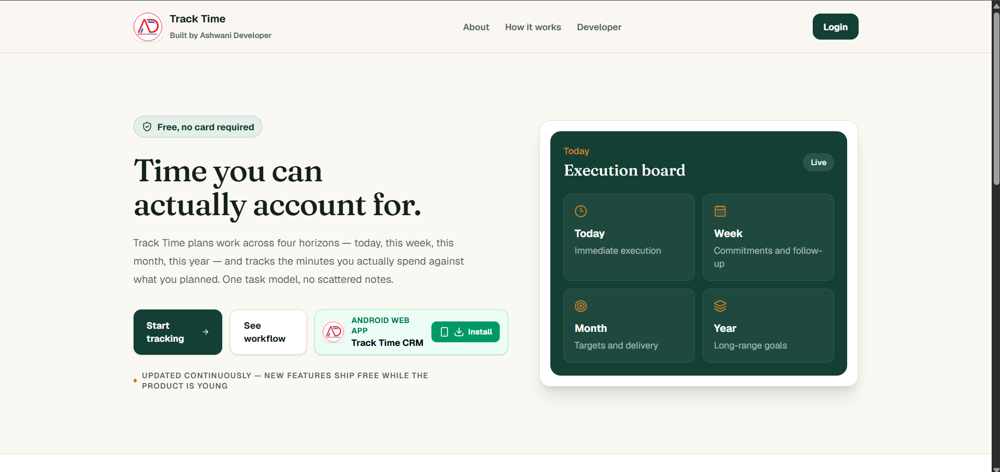
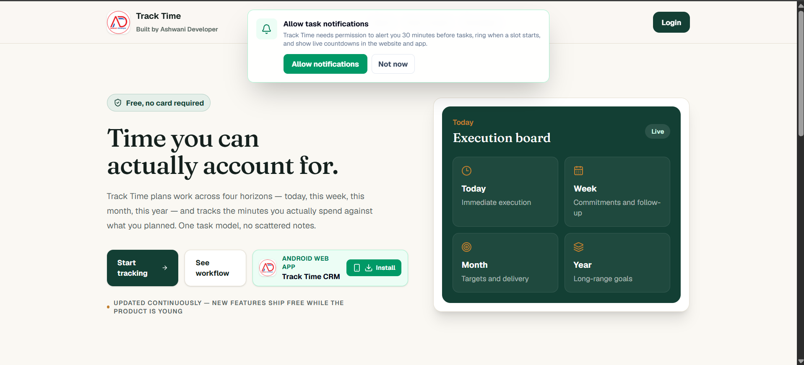
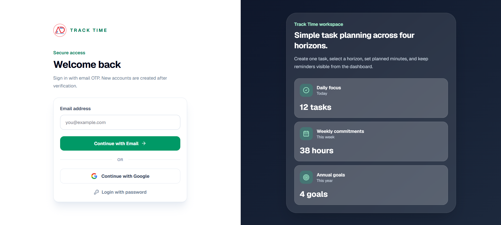
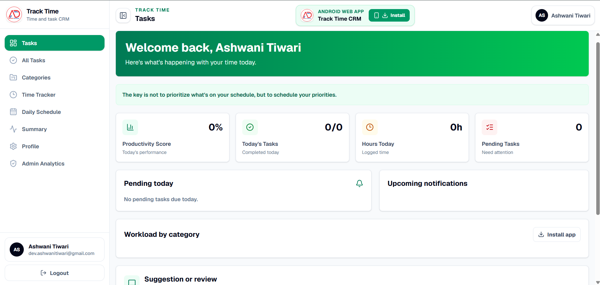
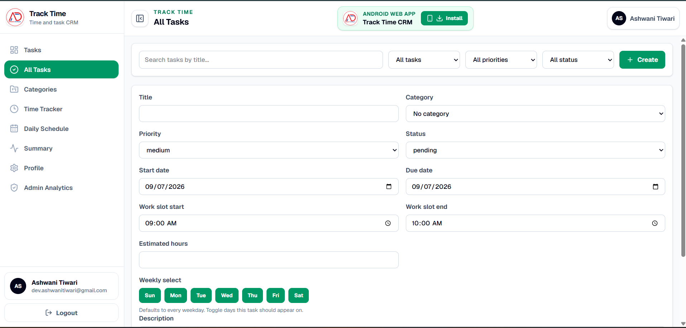
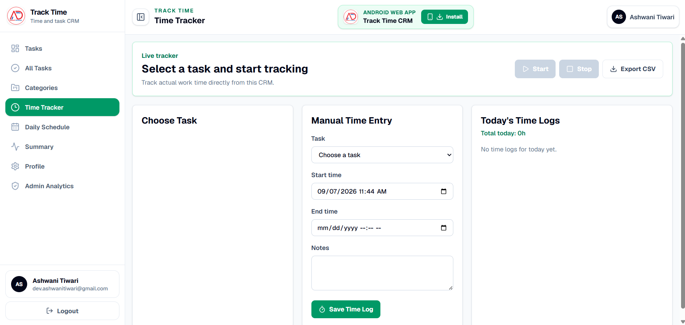
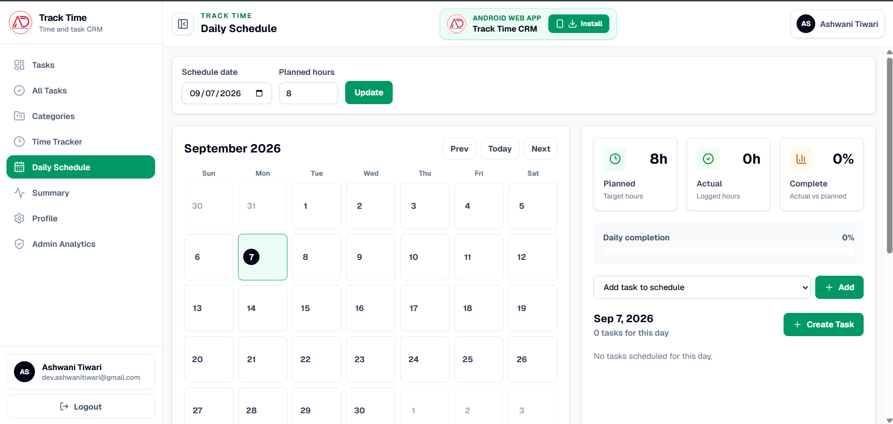
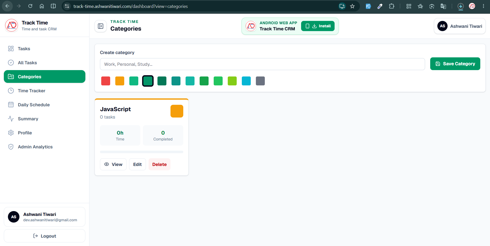

# Track Time

**A free, open-source time and task management CRM** built around four planning horizons — Today, This Week, This Month, This Year — with live timers, reminders, weekly scheduling, analytics, and shareable public streak profiles.

[](LICENSE)
[](https://nextjs.org)
[](https://www.mongodb.com)
[](#contributing)

🔗 **Live app:** [track-time-web.vercel.app](https://track-time-web.vercel.app)

---

## Why Track Time

Most task trackers either forget the time dimension or bolt it on. Track Time treats time as the primary unit: every task belongs to a horizon, carries a planned duration, and gets measured against the time you actually spent — so "productive" is something you can see, not guess.

It's free to use today, actively maintained, and open source so anyone can self-host it, extend it, or contribute back.

## Features

- **Four time horizons** — Day, Week, Month, Year — one task model, filtered by planning window
- **Live timer** — start/stop tracking on any task, with manual time-entry as a fallback
- **Weekly work slots & calendar** — assign tasks to recurring time slots and see them on a real calendar
- **Reminders that fire** — browser push notifications, live countdowns, and an audio alarm when a slot starts
- **Reports & analytics** — planned-vs-actual trends, best weekdays, most productive days, full schedule history
- **CSV export** — download logged time as a CSV for client invoicing
- **Public streak profiles** — opt-in `/u/<username>` page showing your streak, hours logged, and a GitHub-style activity heatmap — never your actual tasks
- **Multiple sign-in methods** — email OTP, password, or Google (Firebase)
- **Role-based admin** — a superadmin analytics view across all users
- **Installable PWA** — add to home screen on Android, desktop Chrome, or Edge
- **Companion mobile app** — Expo/React Native app for viewing today's tasks on the go

## Screenshots

<!-- Add screenshots below — one per row, page name as the caption -->

| Landing page | Login |
|---|---|


| Dashboard overview | Tasks |
|---|---|


| Time tracker | Daily schedule / calendar |
|---|---|


| Categories | Public streak profile |
|---|---|

| Superadmin analytics | Mobile app |
|---|---|
| _screenshot here_ | _screenshot here_ |

## Tech Stack

- **Web and backend:** Next.js App Router
- **API layer:** Next.js Route Handlers under `web/src/app/api`
- **Database:** MongoDB with Mongoose
- **Cache:** in-memory process cache for short-lived task reads
- **Authentication:** Email OTP, password, and Google (Firebase) with httpOnly session cookies
- **Email delivery:** SMTP through Nodemailer
- **Mobile:** React Native with Expo
- **Styling:** Tailwind CSS
- **Repository style:** npm workspaces monorepo

## Folder Structure

```text
Track_Time/
├─ web/
│  ├─ lib/
│  │  ├─ dbConnect.js        MongoDB serverless connection utility
│  │  ├─ auth.js             Sessions, OTP hashing, password hashing
│  │  ├─ streak.js           Streak/activity computation for public profiles
│  │  └─ cache.js            Free in-memory cache utility
│  ├─ models/
│  │  ├─ Task.js             Task schema (horizon, priority, slots, alarms)
│  │  ├─ User.js             Auth user, role, and public-profile fields
│  │  ├─ TimeLog.js          Logged time entries
│  │  ├─ Category.js         Task categories
│  │  ├─ DailySchedule.js    Planned vs actual hours per day
│  │  ├─ OtpToken.js         Email OTP schema
│  │  └─ Session.js          Login session schema
│  ├─ src/
│  │  ├─ app/
│  │  │  ├─ api/             Route handlers (tasks, time-logs, auth, profile, ...)
│  │  │  ├─ dashboard/       Main web dashboard (tasks, timer, reports, profile)
│  │  │  └─ u/[username]/    Public streak profile page
│  │  └─ components/         Shared UI components
│  ├─ package.json
│  └─ vercel.json
├─ mobile/
│  ├─ screens/
│  │  └─ HomeScreen.js       Today's tasks, read-only mobile view
│  ├─ services/
│  │  └─ api.js              Mobile API client
│  ├─ App.tsx
│  └─ package.json
├─ package.json              Root workspace scripts
├─ package-lock.json         Root npm lockfile
├─ LICENSE                   MIT license
├─ .gitignore                Ignore rules for both apps
└─ README.md
```

## Why There Is A Root node_modules Folder

This project uses npm workspaces. When you run `npm install` from the root, npm installs and hoists workspace dependencies into the root `node_modules` folder. That root `node_modules` belongs to the full monorepo and supports both `web` and `mobile`.

You may also see `mobile/node_modules` because Expo created/install-managed mobile dependencies during scaffolding. Both `node_modules` folders are local development artifacts.

They are ignored by Git and should not be pushed to GitHub.

## First-Time Setup

From the root folder:

```bash
npm install
```

This installs dependencies for the root workspace, `web`, and `mobile`.

## Environment Variables

Environment files are ignored by Git. Create them locally and add the production values in Vercel.

### Web Environment

Create:

```text
web/.env.local
```

Use:

```env
MONGODB_URI=your_mongodb_connection_string
MONGODB_DB=track_time
SMTP_HOST=smtp.gmail.com
SMTP_PORT=465
SMTP_SECURE=true
SMTP_USER=your_gmail_address
SMTP_APP_PASSWORD=your_gmail_app_password
EMAIL_FROM="Track Time <your_gmail_address>"
AUTH_SECRET=use_a_long_random_secret_at_least_32_characters
SUPERADMIN_EMAIL=your_superadmin_email
ADMIN_FEEDBACK_EMAIL=your_feedback_inbox_email
NEXT_PUBLIC_FIREBASE_API_KEY=your_firebase_web_api_key
NEXT_PUBLIC_FIREBASE_AUTH_DOMAIN=your_project.firebaseapp.com
NEXT_PUBLIC_FIREBASE_PROJECT_ID=your_project_id
NEXT_PUBLIC_FIREBASE_STORAGE_BUCKET=your_project.firebasestorage.app
NEXT_PUBLIC_FIREBASE_MESSAGING_SENDER_ID=your_sender_id
NEXT_PUBLIC_FIREBASE_APP_ID=your_firebase_app_id
NEXT_PUBLIC_FIREBASE_MEASUREMENT_ID=your_measurement_id
FIREBASE_WEB_API_KEY=your_firebase_web_api_key
```

> `MONGODB_DB` is case-sensitive on MongoDB Atlas — keep it consistent across every environment (local, Vercel) or connections will fail with a "db already exists with different case" error.

### Mobile Environment

After the web app is deployed on Vercel, create:

```text
mobile/.env
```

Use:

```env
EXPO_PUBLIC_API_BASE_URL=https://your-vercel-domain.vercel.app
```

For local Android emulator testing:

```env
EXPO_PUBLIC_API_BASE_URL=http://10.0.2.2:3000
```

For a physical phone on the same Wi-Fi:

```env
EXPO_PUBLIC_API_BASE_URL=http://YOUR_COMPUTER_LAN_IP:3000
```

## Run The Web App Locally

From the root:

```bash
npm run dev:web
```

Open:

```text
http://localhost:3000/dashboard
```

If you are not logged in, the app redirects to:

```text
http://localhost:3000/login
```

The API runs on the same local server:

```text
http://localhost:3000/api/tasks
http://localhost:3000/api/tasks?timeHorizon=1_Day
```

## Run The Mobile App Locally

From the root:

```bash
npm run start:mobile
```

Then use the Expo terminal options to open Android, iOS, or Expo Go.

Android emulator:

```bash
npm run android:mobile
```

iOS simulator on macOS:

```bash
npm run ios:mobile
```

Expo web preview:

```bash
npm run web:mobile
```

## Validate Before Pushing

From the root:

```bash
npm run lint:web
npm run build:web
npm run typecheck:mobile
```

## API Overview

### Authentication

Request OTP:

```http
POST /api/auth/request-otp
```

Body:

```json
{
  "email": "user@example.com"
}
```

Verify OTP:

```http
POST /api/auth/verify-otp
```

Body:

```json
{
  "email": "user@example.com",
  "otp": "123456"
}
```

If the email is new, the user is created automatically. If the email already exists, the user is logged in. The configured `SUPERADMIN_EMAIL` receives the `superadmin` role.

Password and Google sign-in are also available at `/api/auth/password-login` and `/api/auth/firebase-google`.

### Fetch Tasks

```http
GET /api/tasks
```

Optional filter:

```http
GET /api/tasks?timeHorizon=1_Day
```

Valid `timeHorizon` values:

```text
1_Day
1_Week
1_Month
1_Year
```

### Create Task

```http
POST /api/tasks
```

Example body:

```json
{
  "title": "Prepare daily operations report",
  "description": "Compile execution updates and outstanding blockers.",
  "status": "pending",
  "timeHorizon": "1_Day",
  "timeAllocated": 120,
  "timeSpent": 30,
  "isAlarmSet": true,
  "alarmTime": "2026-08-08T09:00:00.000Z",
  "pushToken": "expo_push_token_here"
}
```

`timeAllocated` and `timeSpent` are stored in minutes.

### Export Time Logs

```http
GET /api/time-logs/export
GET /api/time-logs/export?start=2026-08-01&end=2026-08-31
```

Returns a CSV download of the authenticated user's logged time, ready for client invoicing.

### Public Profile

```http
PATCH /api/profile
```

Body (any subset):

```json
{
  "username": "yourname",
  "publicProfile": true
}
```

Once set, the profile is visible at `/u/<username>` — showing current streak, longest streak, hours logged, and a 12-week activity heatmap. Off by default; task and time-log content is never exposed.

## Deploy Web To Vercel

1. Push this repository to GitHub.
2. In Vercel, import the GitHub repository.
3. Set the Vercel Root Directory to:

```text
web
```

4. Keep Framework Preset as Next.js.
5. Use:

```text
Install Command: npm install
Build Command: npm run build
Output Directory: .next
```

6. Add the same environment variables listed under [Web Environment](#web-environment) in Vercel's project settings.
7. Deploy.
8. Open:

```text
https://your-vercel-domain.vercel.app/dashboard
```

Login page:

```text
https://your-vercel-domain.vercel.app/login
```

Superadmin analytics:

```text
https://your-vercel-domain.vercel.app/superadmin
```

The backend API will be available on the same Vercel domain:

```text
https://your-vercel-domain.vercel.app/api/tasks
```

## Connect Mobile To Vercel API

After Vercel deployment, copy your Vercel domain into:

```text
mobile/.env
```

Example:

```env
EXPO_PUBLIC_API_BASE_URL=https://track-time-web.vercel.app
```

Restart Expo after changing this value:

```bash
npm run start:mobile
```

## Contributing

Track Time is open source and contributions are welcome — bug fixes, new features, mobile parity work, or docs improvements.

1. Fork the repository and create a branch off `main`.
2. Make your change, keeping it scoped to one concern per PR.
3. Run `npm run lint:web` and `npm run build:web` before pushing.
4. Open a pull request describing what changed and why.

If you're planning a larger feature, open an issue first so it can be discussed before you invest the time.

## License

Track Time is [MIT licensed](LICENSE) — free to use, modify, and self-host, including commercially.
